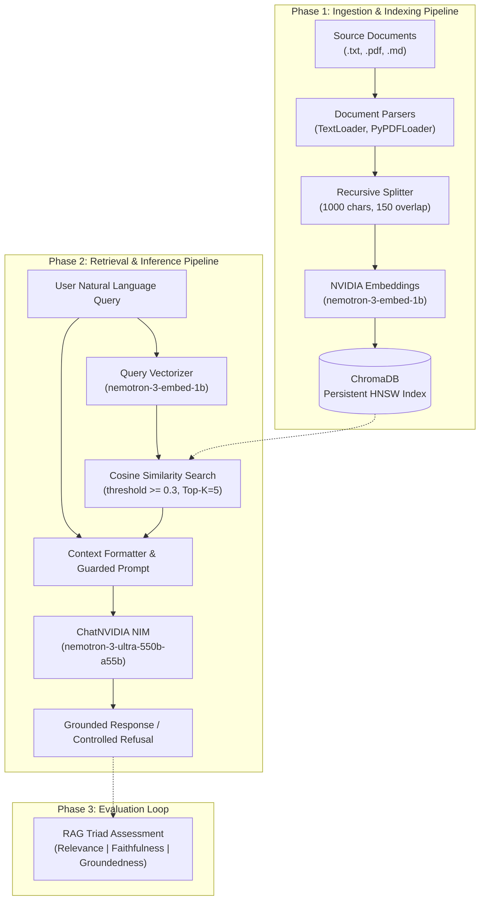
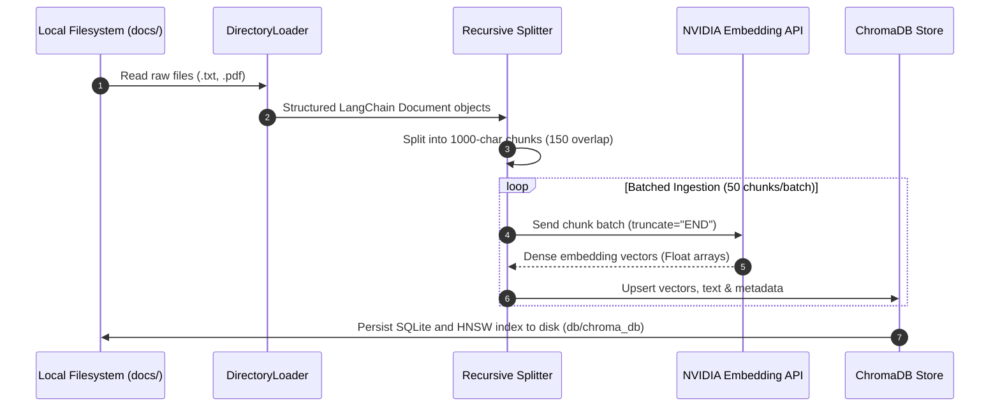
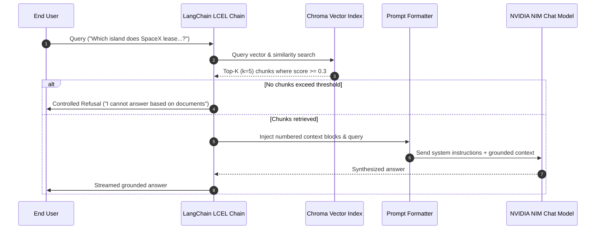
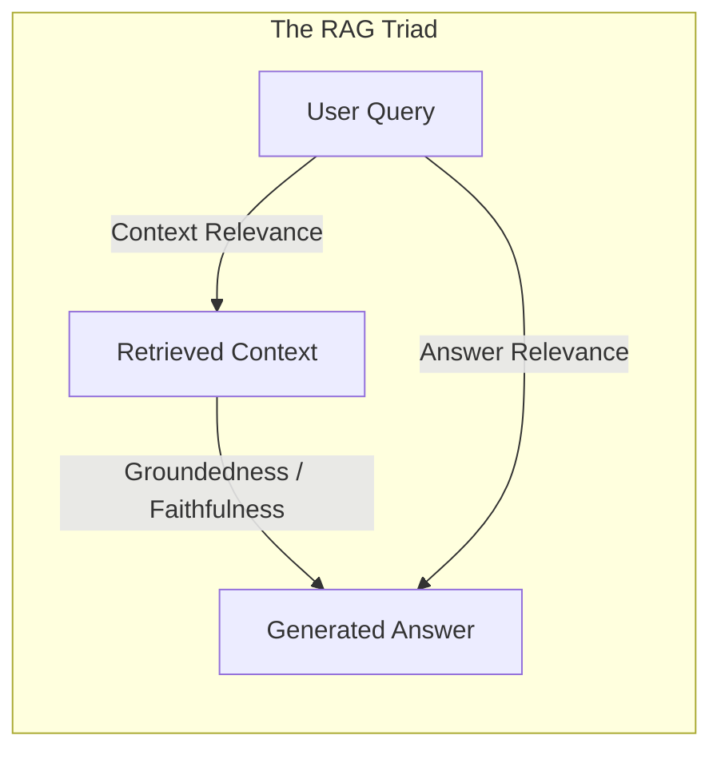

# Architecture & Implementation Plan: Enterprise-Grade RAG Pipeline

A comprehensive blueprint and architectural reference for building, deploying, and maintaining a robust **Retrieval-Augmented Generation (RAG)** pipeline using **LangChain LCEL**, **NVIDIA AI Foundation / NIM endpoints**, and **ChromaDB**.

---

## 📑 Table of Contents

- [1. Executive Architectural Blueprint](#1-executive-architectural-blueprint)
- [2. Phase 1: Document Ingestion & Indexing (Offline Pipeline)](#2-phase-1-document-ingestion--indexing-offline-pipeline)
  - [Step 1: Multi-Format Document Sourcing & Parsing](#step-1-multi-format-document-sourcing--parsing)
  - [Step 2: Semantic Text Chunking & Boundary Strategy](#step-2-semantic-text-chunking--boundary-strategy)
  - [Step 3: Dense Vector Embedding Generation](#step-3-dense-vector-embedding-generation)
  - [Step 4: Vector Indexing & Local Storage (ChromaDB)](#step-4-vector-indexing--local-storage-chromadb)
- [3. Phase 2: Retrieval & Inference (Online Pipeline)](#3-phase-2-retrieval--inference-online-pipeline)
  - [Step 5: Query Vectorization & Similarity Threshold Retrieval](#step-5-query-vectorization--similarity-threshold-retrieval)
  - [Step 6: Context Assembly & Guardrail Prompt Engineering](#step-6-context-assembly--guardrail-prompt-engineering)
  - [Step 7: Grounded LLM Generation via NVIDIA NIM](#step-7-grounded-llm-generation-via-nvidia-nim)
- [4. Phase 3: Evaluation, Observability & Quality Assurance](#4-phase-3-evaluation-observability--quality-assurance)
  - [Step 8: The RAG Triad Scoring Framework](#step-8-the-rag-triad-scoring-framework)
  - [Step 9: Continuous Monitoring & Latency Optimization](#step-9-continuous-monitoring--latency-optimization)
- [5. Reference Implementation Blueprint](#5-reference-implementation-blueprint)
- [6. Failure Modes, Mitigations & Best Practices](#6-failure-modes-mitigations--best-practices)

---

## 1. Executive Architectural Blueprint

A robust RAG system decouples static knowledge indexing from real-time question answering. The end-to-end architecture is divided into two primary sub-systems and an automated evaluation loop:



---

## 2. Phase 1: Document Ingestion & Indexing (Offline Pipeline)

The goal of Phase 1 is to convert unstructured domain documents into clean, searchable, high-dimensional vector embeddings stored with rich lineage metadata.



### Step 1: Multi-Format Document Sourcing & Parsing
* **Objective:** Recursively traverse repository storage, extract textual content, and preserve document provenance (file paths, page numbers, timestamps).
* **Engineering Considerations:**
  - Standard text documents use UTF-8 readers.
  - Multi-page documents like PDFs require layout-aware parsers (`pypdf`, `pymupdf`) to extract text per page with page metadata.
  - Corrupt or empty files must be safely skipped or flagged to prevent pipeline aborts.
* **Failure Mode if Missed:** Inability to index nested directories, broken encoding crashes, or lost document provenance.

### Step 2: Semantic Text Chunking & Boundary Strategy
* **Objective:** Divide continuous text into uniform, semantically cohesive segments that fit comfortably inside embedding and LLM context windows.
* **Selected Parameters:**
  - **Chunk Size:** `1000` characters (~200–250 tokens), striking a balance between specific factual answers and sufficient narrative context.
  - **Chunk Overlap:** `150` characters (~30–40 tokens), preserving semantic continuity across chunk boundaries so facts spanning borders are not lost.
  - **Hierarchical Separators:** `["\n\n", "\n", " ", ""]` to prioritize splitting on paragraphs, then sentences, and words before arbitrary character slicing.
* **Failure Mode if Missed:** Oversized chunks dilute semantic vector focus and hit token limits; undersized chunks lose necessary context.

### Step 3: Dense Vector Embedding Generation
* **Objective:** Map text chunks into dense continuous vector space where semantically similar passages share close proximity under geometric distance metrics.
* **Model Selection:** `nvidia/nemotron-3-embed-1b` via NVIDIA AI Foundation / NIM endpoints.
* **Key Features:**
  - Input truncation safety (`truncate="END"`) to avoid crashing on outlier chunk sizes.
  - High semantic fidelity optimized for enterprise knowledge retrieval.
  - Batched network calls (50 chunks per batch) with throttled pacing (`0.5s` delays) to operate smoothly within rate limits.
* **Failure Mode if Missed:** Keyword-only search fails on synonyms, colloquial expressions, and rephrased queries.

### Step 4: Vector Indexing & Local Storage (ChromaDB)
* **Objective:** Persist vector embeddings alongside source text and metadata using high-performance approximate nearest neighbor (ANN) indexes.
* **Storage Configuration:**
  - **Engine:** ChromaDB local storage (`db/chroma_db`).
  - **Distance Metric:** Cosine distance (`{"hnsw:space": "cosine"}`), normalizing vector lengths for scale-invariant angular comparisons.
  - **Index Algorithm:** Hierarchical Navigable Small World (HNSW) for sub-millisecond similarity lookups.
* **Failure Mode if Missed:** Ephemeral in-memory stores require full re-indexing upon every process restart, multiplying cost and latency.

---

## 3. Phase 2: Retrieval & Inference (Online Pipeline)

The goal of Phase 2 is to take an incoming user query in real time, extract the most pertinent source passages, and synthesize an accurate, grounded response.



### Step 5: Query Vectorization & Similarity Threshold Retrieval
* **Objective:** Vectorize the user's question using the identical embedding model and retrieve relevant context chunks while filtering irrelevant noise.
* **Implementation Strategy:**
  - **Model Parity:** Must use `nvidia/nemotron-3-embed-1b` to ensure geometric space compatibility.
  - **Search Type:** `similarity_score_threshold`.
  - **Search Parameters:** `k=5`, `score_threshold=0.3`.
  - **Why Score Thresholding:** Basic Top-$K$ retrieval always returns $K$ documents, even for queries completely unrelated to the knowledge base. Setting a minimum score threshold discards irrelevant low-scoring fragments before they pollute LLM context.
* **Failure Mode if Missed:** Low-scoring noise fills the prompt, prompting hallucinations or irrelevant summaries.

### Step 6: Context Assembly & Guardrail Prompt Engineering
* **Objective:** Structure retrieved text chunks and enforce non-negotiable guidelines preventing hallucination.
* **Prompt Engineering Design:**
  ```text
  You are a helpful assistant. Use ONLY the following retrieved context to answer the user's question.
  If the answer cannot be found in the context, respond with "I cannot answer this question based on the provided documents."

  Context:
  {context}

  Question:
  {question}

  Answer:
  ```
* **Formatter Function:** Enforces clear chunk boundaries by indexing each passage as `--- Document {i} ---`.
* **Failure Mode if Missed:** LLMs fall back onto pre-trained biases and fabricate details when source context is ambiguous.

### Step 7: Grounded LLM Generation via NVIDIA NIM
* **Objective:** Run natural-language synthesis through a high-reasoning foundation model hosted on NVIDIA NIM endpoints.
* **Model Selection:** `nvidia/nemotron-3-ultra-550b-a55b` (or `meta/llama-3.1-70b-instruct`).
* **Generation Settings:**
  - `temperature=0.1`: Low variance to prioritize deterministic factual extraction over creative prose.
  - Integration through LangChain's `ChatNVIDIA` class using LCEL (`StrOutputParser`).
* **Failure Mode if Missed:** Unparsed raw chunks output directly to users without synthesis, or excessive creativity introducing fabricated claims.

---

## 4. Phase 3: Evaluation, Observability & Quality Assurance

A production-ready RAG system requires continuous empirical measurement to prevent regressions when tuning hyperparameters (chunk size, model checkpoints, prompts).



### Step 8: The RAG Triad Scoring Framework

| Metric | Target Relationship | Core Question | Failure Indication |
| :--- | :--- | :--- | :--- |
| **Context Relevance** | Query $\leftrightarrow$ Context | Did the retriever fetch chunks directly related to the question? | Low score = Retriever fetched noisy, off-topic chunks. Tune chunk size or threshold. |
| **Groundedness (Faithfulness)** | Context $\leftrightarrow$ Answer | Is every statement in the answer directly traceable to the context? | Low score = The model hallucinated external knowledge not in the corpus. |
| **Answer Relevance** | Query $\leftrightarrow$ Answer | Does the generated answer address the user's explicit question? | Low score = The model provided true facts that fail to answer what was asked. |

### Step 9: Continuous Monitoring & Latency Optimization
- **Rate-Limiting & Backoff:** Ensure batch ingestion uses retry mechanisms (e.g., `tenacity`) with exponential backoff on HTTP 429 errors.
- **Latency Profiling:** Track wall-clock time spent in (1) query embedding, (2) Chroma DB vector lookup, and (3) LLM token generation.
- **Re-ranking (Future Stage):** For large corpora, retrieve Top-20 candidates using ANN and pass through a cross-encoder re-ranker (such as NVIDIA NeMo Retriever) to narrow down to Top-5 before prompt insertion.

---

## 5. Reference Implementation Blueprint

Below is the verified, modern LangChain Expression Language (LCEL) implementation blueprint matching this project's architecture:

### 1. Ingestion Pipeline Blueprint
```python
import os
import time
from dotenv import load_dotenv
from langchain_chroma import Chroma
from langchain_community.document_loaders import DirectoryLoader, TextLoader
from langchain_nvidia_ai_endpoints import NVIDIAEmbeddings
from langchain_text_splitters import RecursiveCharacterTextSplitter

load_dotenv()

def run_ingestion(docs_dir="docs", persist_dir="db/chroma_db"):
    # 1. Load documents
    loader = DirectoryLoader(docs_dir, glob="*.txt", loader_cls=TextLoader)
    documents = loader.load()

    # 2. Split chunks
    splitter = RecursiveCharacterTextSplitter(chunk_size=1000, chunk_overlap=150)
    chunks = splitter.split_documents(documents)

    # 3. Initialize NVIDIA Embeddings & ChromaDB
    embeddings = NVIDIAEmbeddings(
        model="nvidia/nemotron-3-embed-1b",
        truncate="END"
    )
    vector_store = Chroma(
        persist_directory=persist_dir,
        embedding_function=embeddings,
        collection_metadata={"hnsw:space": "cosine"}
    )

    # 4. Batch upsert
    batch_size = 50
    for i in range(0, len(chunks), batch_size):
        batch = chunks[i : i + batch_size]
        vector_store.add_documents(batch)
        time.sleep(0.5)

    print(f"Successfully indexed {len(chunks)} chunks in {persist_dir}")

if __name__ == "__main__":
    run_ingestion()
```

### 2. Retrieval & Inference Pipeline Blueprint
```python
from dotenv import load_dotenv
from langchain_chroma import Chroma
from langchain_core.output_parsers import StrOutputParser
from langchain_core.prompts import ChatPromptTemplate
from langchain_core.runnables import RunnablePassthrough
from langchain_nvidia_ai_endpoints import ChatNVIDIA, NVIDIAEmbeddings

load_dotenv()

# 1. Connect to Vector Store
embeddings = NVIDIAEmbeddings(model="nvidia/nemotron-3-embed-1b", truncate="END")
db = Chroma(
    persist_directory="db/chroma_db",
    embedding_function=embeddings,
    collection_metadata={"hnsw:space": "cosine"}
)

retriever = db.as_retriever(
    search_type="similarity_score_threshold",
    search_kwargs={"k": 5, "score_threshold": 0.3}
)

# 2. LLM & Prompt
llm = ChatNVIDIA(model="nvidia/nemotron-3-ultra-550b-a55b", temperature=0.1)

template = """You are a helpful assistant. Use ONLY the following retrieved context to answer the user's question.
If the answer cannot be found in the context, respond with "I cannot answer this question based on the provided documents."

Context:
{context}

Question:
{question}

Answer:"""
prompt = ChatPromptTemplate.from_template(template)

def format_docs(docs):
    return "\n\n".join(f"--- Document {i} ---\n{d.page_content}" for i, d in enumerate(docs, 1))

# 3. Construct LCEL Chain
rag_chain = (
    {"context": retriever | format_docs, "question": RunnablePassthrough()}
    | prompt
    | llm
    | StrOutputParser()
)

if __name__ == "__main__":
    query = "Which island does SpaceX lease for its launches in the pacific"
    answer = rag_chain.invoke(query)
    print(f"Answer: {answer}")
```

---

## 6. Failure Modes, Mitigations & Best Practices

| Risk / Failure Mode | Root Cause | Engineering Mitigation |
| :--- | :--- | :--- |
| **Embedding Dimension Mismatch** | Changing embedding models without resetting the Chroma store | Purge the database directory (`rm -rf db/chroma_db`) before re-indexing under a new model. |
| **Silent Retrieval Misses** | Similarity threshold set too high (e.g. `> 0.7` on cosine distance) | Lower `score_threshold` to `0.2`–`0.3` or inspect cosine score distributions on validation queries. |
| **API Rate Limiting (HTTP 429)** | Blasting large corpora without throttling | Ingest in batches with small sleep pauses (`time.sleep(0.5)`) and implement exponential backoff via `tenacity`. |
| **Out-of-Context Hallucinations** | Vague prompts allowing the LLM to pull from pretraining weights | Enforce strict negative constraints: *"If the answer cannot be found, respond with 'I cannot answer...'"*. |
| **Boundary Fact Clipping** | Splitting sentences or tabular data without overlap | Maintain at least 15% overlap (`chunk_overlap=150` for `chunk_size=1000`) and use multi-character separators. |