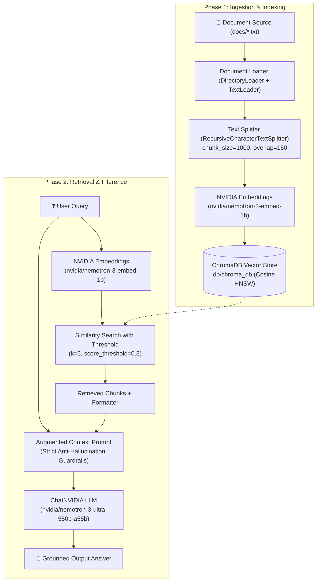

# Simple RAG Pipeline

A lightweight, modular, and production-ready **Retrieval-Augmented Generation (RAG)** pipeline built with **Python**, **LangChain**, **NVIDIA AI Foundation / NIM Endpoints**, and **ChromaDB**.

---

## 📖 Table of Contents

- [Overview](#overview)
- [System Architecture](#system-architecture)
  - [1. Ingestion Pipeline (Offline Indexing)](#1-ingestion-pipeline-offline-indexing)
  - [2. Retrieval & Generation Pipeline (Online Inference)](#2-retrieval--generation-pipeline-online-inference)
- [Repository Structure](#repository-structure)
- [Tech Stack](#tech-stack)
- [Prerequisites](#prerequisites)
- [Installation & Setup](#installation--setup)
- [Quick Start Guide](#quick-start-guide)
  - [Step 1: Check Active NVIDIA Models](#step-1-check-active-nvidia-models)
  - [Step 2: Ingest and Index Documents](#step-2-ingest-and-index-documents)
  - [Step 3: Ask Questions & Retrieve Answers](#step-3-ask-questions--retrieve-answers)
- [Component Deep-Dive](#component-deep-dive)
  - [Ingestion Pipeline (`ingestion_pipeline.py`)](#ingestion-pipeline-ingestion_pipelinepy)
  - [Retrieval Pipeline (`retrieval_pipeline.py`)](#retrieval-pipeline-retrieval_pipelinepy)
  - [Diagnostic Utility (`test.py`)](#diagnostic-utility-testpy)
- [Configuration & Customization](#configuration--customization)
  - [Tuning Chunking Parameters](#tuning-chunking-parameters)
  - [Tuning Retrieval Thresholds](#tuning-retrieval-thresholds)
  - [Adding Multi-format Ingestion (PDF, Markdown)](#adding-multi-format-ingestion-pdf-markdown)
- [Troubleshooting & Common Questions](#troubleshooting--common-questions)
- [Roadmap & Enhancements](#roadmap--enhancements)
- [License](#license)

---

## Overview

Retrieval-Augmented Generation (RAG) grounds Large Language Model (LLM) responses on external, domain-specific text documents, drastically reducing hallucinations and keeping responses up-to-date without model fine-tuning.

This project implements a complete two-phase RAG lifecycle:
1. **Document Ingestion & Indexing**: Scans raw documents in [`docs/`](docs/), splits them into semantically meaningful chunks with overlap, generates high-dimensional embeddings using NVIDIA's `nvidia/nemotron-3-embed-1b`, and stores them locally in a persistent Chroma vector database with cosine similarity indexing.
2. **Retrieval & Augmented Generation**: Accepts user queries, computes similarity scores against indexed chunks using a score threshold filter, constructs a grounded context prompt, and generates factual answers via NVIDIA's `nvidia/nemotron-3-ultra-550b-a55b` LLM.

---

## System Architecture



### 1. Ingestion Pipeline (Offline Indexing)
1. **Document Loading**: Loads plain-text documents from the [`docs/`](docs/) directory.
2. **Text Splitting**: Uses `RecursiveCharacterTextSplitter` with separators `["\n\n", "\n", " ", ""]`, ensuring paragraphs and sentences are not split mid-thought.
3. **Batch Embedding**: Passes document chunks in batches of 50 to `nvidia/nemotron-3-embed-1b` (with safe input truncation enabled).
4. **Vector Persistence**: Writes dense vectors and original text content to disk at [`db/chroma_db/`](db/chroma_db/).

### 2. Retrieval & Generation Pipeline (Online Inference)
1. **Query Embedding**: The incoming natural language question is converted into a vector with the identical embedding model.
2. **Threshold Filtering**: Chroma retrieves top $K=5$ matches, discarding chunks whose similarity score falls below `0.3` to avoid introducing irrelevant noise.
3. **Prompt Augmentation**: Top chunks are formatted into numbered blocks and inserted into a strict system prompt instruction.
4. **Response Generation**: `ChatNVIDIA` synthesizes the answer based *only* on the provided context, replying with a refusal statement if the context does not contain sufficient information.

---

## Repository Structure

```text
simple-rag-pipeline/
├── db/                        # Persistent local database directory (git-ignored)
│   └── chroma_db/             # Chroma SQLite metadata and vector index files
├── docs/                      # Knowledge base documents
│   ├── Google.txt             # Overview & history of Google
│   ├── Microsoft.txt          # Overview & history of Microsoft
│   ├── Nvidia.txt             # Overview & history of NVIDIA
│   ├── SpaceX.txt             # Overview & history of SpaceX
│   ├── Tesla.txt              # Overview & history of Tesla
│   └── attention-is-all-you-need.pdf # Transformer research paper
├── .env                       # Environment secrets (git-ignored)
├── .env.example               # Template for environment configuration
├── .gitignore                 # Standard git ignore definitions
├── ingestion_pipeline.py      # Script to load, chunk, embed, and store documents
├── Plan.md                    # Conceptual RAG architecture design document
├── README.md                  # Comprehensive project documentation
├── requirements.txt           # Python package dependencies
├── retrieval_pipeline.py      # Query answering chain with LangChain LCEL & NIM
└── test.py                    # Diagnostic tool to inspect active NVIDIA chat models
```

---

## Tech Stack

| Component | Technology | Description |
| :--- | :--- | :--- |
| **Framework** | [LangChain](https://www.langchain.com/) (`v1.4.x` / LCEL) | Orchestration of retrieval and generation pipelines |
| **LLM Inference** | [NVIDIA NIM Endpoints](https://build.nvidia.com/) (`ChatNVIDIA`) | Hosted foundation models (`nvidia/nemotron-3-ultra-550b-a55b`) |
| **Embeddings** | [NVIDIA NIM Embeddings](https://build.nvidia.com/) (`NVIDIAEmbeddings`) | Dense embeddings via `nvidia/nemotron-3-embed-1b` |
| **Vector Database** | [ChromaDB](https://www.trychroma.com/) (`langchain-chroma`) | Embedded local vector database with HNSW indexing |
| **Text Chunking** | `langchain-text-splitters` | Recursive character-based document segmentation |
| **Config / Env** | `python-dotenv` | Twelve-factor configuration loading |

---

## Prerequisites

1. **Python**: Python 3.10, 3.11, or 3.12 installed.
2. **NVIDIA AI API Key**: Sign up at [NVIDIA build](https://build.nvidia.com/) to get an API key with access to free hosted NIM endpoints.

---

## Installation & Setup

### 1. Clone the Repository
```bash
git clone <repository-url>
cd simple-rag-pipeline
```

### 2. Set Up a Virtual Environment
```bash
python3 -m venv venv
source venv/bin/activate
# On Windows use: venv\Scripts\activate
```

### 3. Install Required Dependencies
```bash
pip install --upgrade pip
pip install -r requirements.txt
```

### 4. Configure Environment Variables
Copy `.env.example` to `.env` and fill in your NVIDIA API key:
```bash
cp .env.example .env
```
Edit `.env`:
```ini
NVIDIA_API_KEY=nvapi-your-nvidia-api-key-here
```

---

## Quick Start Guide

### Step 1: Check Active NVIDIA Models
To verify API connectivity and review the models currently available on your endpoint:
```bash
python test.py
```
*Expected Output:*
```text
Available active chat models:
 - nvidia/nemotron-3-ultra-550b-a55b
 - meta/llama-3.1-405b-instruct
 - meta/llama-3.1-70b-instruct
 ...
```

---

### Step 2: Ingest and Index Documents
Place your `.txt` files inside the [`docs/`](docs/) folder and run the ingestion pipeline:
```bash
python ingestion_pipeline.py
```

*Expected Output:*
```text
Loading documents from docs...
Loaded 5 documents.
Splitting documents into chunks (size=1000, overlap=150)...
Split into 14 chunks.
Initializing vector store in db/chroma_db with NVIDIA Embeddings...
Embedding 14 chunks in batches of 50...
-> Ingesting chunks 1 to 14 of 14...

Vector store successfully populated at 'db/chroma_db'.
```

---

### Step 3: Ask Questions & Retrieve Answers
Run the retrieval script to ask a question against your indexed documents:
```bash
python retrieval_pipeline.py
```

*Example Query:*
> "Which island does SpaceX lease for its launches in the pacific"

*Example Response:*
```text
User Query: Which island does SpaceX lease for its launches in the pacific

LLM answer:
Based on the provided documents, SpaceX leased Omelek Island in the Kwajalein Atoll to launch its Falcon 1 rockets.
```

---

## Component Deep-Dive

### Ingestion Pipeline (`ingestion_pipeline.py`)

- **`load_documents(docs_path="docs")`**:
  Validates directory existence and loads files using `DirectoryLoader` with `TextLoader`. Raises `FileNotFoundError` or `ValueError` if the directory or text files are missing.
- **`split_documents(documents, chunk_size=1000, chunk_overlap=150)`**:
  Slices text documents into chunks using `RecursiveCharacterTextSplitter`. Overlap prevents semantic information from being severed at boundary boundaries.
- **`create_vector_store(chunks, persist_directory="db/chroma_db", batch_size=50)`**:
  Connects to `Chroma` with `hnsw:space: "cosine"`. Ingests vectors in batches of 50 with small pacing intervals (`time.sleep(0.5)`) to maintain stability under API rate limits.

### Retrieval Pipeline (`retrieval_pipeline.py`)

- **Retriever Setup**:
  ```python
  retriever = db.as_retriever(
      search_type="similarity_score_threshold",
      search_kwargs={
          "k": 5,
          "score_threshold": 0.3,
      },
  )
  ```
  Uses cosine similarity thresholding to ignore low-scoring, non-relevant chunks.
- **Strict Guardrail Prompt**:
  Forces the model to only answer based on retrieved documents and strictly output `"I cannot answer this question based on the provided documents."` if the information is missing.
- **LCEL Chain Composition**:
  ```python
  rag_chain = (
      {"context": retriever | format_docs, "question": RunnablePassthrough()}
      | prompt
      | llm
      | StrOutputParser()
  )
  ```
  Declarative, readable, and stream-capable execution flow.

### Diagnostic Utility (`test.py`)
Queries the NVIDIA endpoints directly to verify authentication and dynamically list models supporting `chat`.

---

## Configuration & Customization

### Tuning Chunking Parameters
In [`ingestion_pipeline.py`](ingestion_pipeline.py):
```python
# Shorter chunks for granular facts, longer chunks for broad context:
chunks = split_documents(documents, chunk_size=750, chunk_overlap=100)
```

### Tuning Retrieval Thresholds
In [`retrieval_pipeline.py`](retrieval_pipeline.py):
- **`k`**: Maximum number of documents to retrieve (default: `5`).
- **`score_threshold`**: Minimum similarity score threshold (default: `0.3`). If your queries return empty context, decrease this threshold (e.g. `0.2` or `0.15`).

### Adding Multi-format Ingestion (PDF, Markdown)
To ingest PDFs or Markdown documents along with `.txt` files, update `load_documents` in [`ingestion_pipeline.py`](ingestion_pipeline.py):
```python
from langchain_community.document_loaders import DirectoryLoader, TextLoader, PyPDFLoader

def load_documents(docs_path="docs"):
    # Load TXT files
    txt_loader = DirectoryLoader(docs_path, glob="*.txt", loader_cls=TextLoader)
    # Load PDF files
    pdf_loader = DirectoryLoader(docs_path, glob="*.pdf", loader_cls=PyPDFLoader)
    
    documents = txt_loader.load() + pdf_loader.load()
    return documents
```

---

## Troubleshooting & Common Questions

### 1. `401 Unauthorized` or `Invalid API Key`
- **Cause**: Missing or incorrect `NVIDIA_API_KEY` in your `.env` file.
- **Fix**: Check your key at [build.nvidia.com](https://build.nvidia.com/), verify it starts with `nvapi-`, and ensure `.env` is located in the root project folder.

### 2. Embedding Dimension Mismatch Error in Chroma
- **Cause**: You switched embedding models (e.g., from OpenAI to NVIDIA, or between different NVIDIA embedding models), but old vectors with different dimensions exist in [`db/chroma_db`](db/chroma_db).
- **Fix**: Delete the existing database folder before re-ingesting:
  ```bash
  rm -rf db/chroma_db
  python ingestion_pipeline.py
  ```

### 3. Model replies: *"I cannot answer this question based on the provided documents."*
- **Cause**:
  1. The information is genuinely not in [`docs/`](docs/).
  2. The `score_threshold` (default `0.3`) in [`retrieval_pipeline.py`](retrieval_pipeline.py) filtered out all chunks.
- **Fix**: Test lowering `score_threshold` to `0.15` or temporarily switch `search_type="similarity"` with `search_kwargs={"k": 4}`.

---

## Roadmap & Enhancements

- [ ] Add PDF and Word document parsers to the default ingestion flow.
- [ ] Implement an interactive CLI query loop or Streamlit web UI.
- [ ] Add re-ranking (e.g., using NVIDIA NeMo Retriever / Cohere reranker) for improved retrieval precision.
- [ ] Add automated evaluation metrics using the RAG Triad (Context Relevance, Faithfulness, Answer Relevance).
- [ ] Implement query rewriting / multi-query expansion for complex questions.

---

## License

This project is licensed under the MIT License. See [LICENSE](LICENSE) for details.
